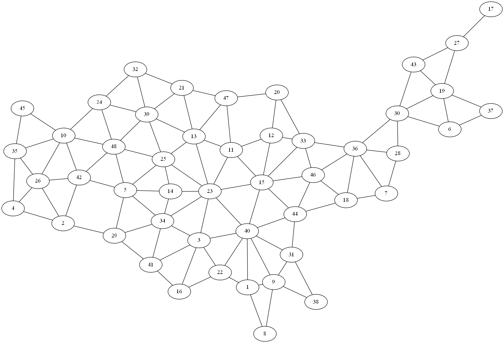

# アメリカ合衆国の隣接関係グラフ

## 48 州グラフ

アメリカ合衆国50州のうち、アラスカとハワイを除いた48州の
隣接関係を表したグラフ（各州を頂点とし、陸続きで隣接している
州の間に辺を張ったグラフ）。

[フォー・コーナーズ](https://ja.wikipedia.org/wiki/%E3%83%95%E3%82%A9%E3%83%BC%E3%83%BB%E3%82%B3%E3%83%BC%E3%83%8A%E3%83%BC%E3%82%BA_(%E3%82%A2%E3%83%A1%E3%83%AA%E3%82%AB%E5%90%88%E8%A1%86%E5%9B%BD)) の斜め同士（AZ と CO、UT と NM）には辺は無し。

The art of computer programming 4A, 254 ページ、図 (133) に描かれているグラフと同じ。

### 48 州グラフの図

頂点ラベルが2レターの図

頂点ラベルが番号の図

## 49 州区グラフ

アメリカ合衆国50州のうち、アラスカとハワイを除き、コロンビア特別区を
49州区の隣接関係を表したグラフ（各州を頂点とし、陸続きで隣接している
州の間に辺を張ったグラフ）。

[フォー・コーナーズ](https://ja.wikipedia.org/wiki/%E3%83%95%E3%82%A9%E3%83%BC%E3%83%BB%E3%82%B3%E3%83%BC%E3%83%8A%E3%83%BC%E3%82%BA_(%E3%82%A2%E3%83%A1%E3%83%AA%E3%82%AB%E5%90%88%E8%A1%86%E5%9B%BD)) の斜め同士（AZ と CO、UT と NM）には辺は無し。

The art of computer programming 4A, 210 ページ、図 (18) に描かれているグラフと同じ。

# 図

頂点ラベルが2レターの図

頂点ラベルが番号の図

# ファイル

* us48.txt: 48 州グラフの隣接リスト。頂点は 1 から 48 までの番号で表す。番号と州の対応表は states48.txt にある。
* us48_letter.txt: 48 州グラフの隣接リスト。頂点は[州の略号](https://www.bls.gov/nls/79quex/r19/y79r19attach102.pdf)（アルファベット大文字2文字）。
* states48.txt: 48 州のリスト。
* us49.txt: 49 州区グラフの隣接リスト。頂点は 1 から 49 までの番号で表す。番号と州の対応表は states49.txt にある。states48.txt と頂点番号は異なることに注意。
* us49_letter.txt: 49 州区グラフの隣接リスト。頂点は[州区の略号](https://www.bls.gov/nls/79quex/r19/y79r19attach102.pdf)（アルファベット大文字2文字）。
* states49.txt: 49 州区のリスト。

## Reference

* NLSY 79 ATTACHMENT 102: FEDERAL INFORMATION PROCESSING STANDARDS PUBLICATION 5-1
https://www.bls.gov/nls/79quex/r19/y79r19attach102.pdf
* County Adjacency File
https://www.census.gov/geographies/reference-files/2010/geo/county-adjacency.html
* The National Map Small Scale
https://nationalmap.gov/small_scale/printable/congress.html#ia
https://nationalmap.gov/small_scale/printable/images/pdf/congdist/pagecgd113_us-all.pdf
* Wikipedia: Outline of the United States: Administrative divisions of the United States
https://en.wikipedia.org/wiki/Outline_of_the_United_States#Administrative_divisions_of_the_United_States
* Wikipedia: List of U.S. state abbreviations
https://en.wikipedia.org/wiki/List_of_U.S._state_abbreviations
